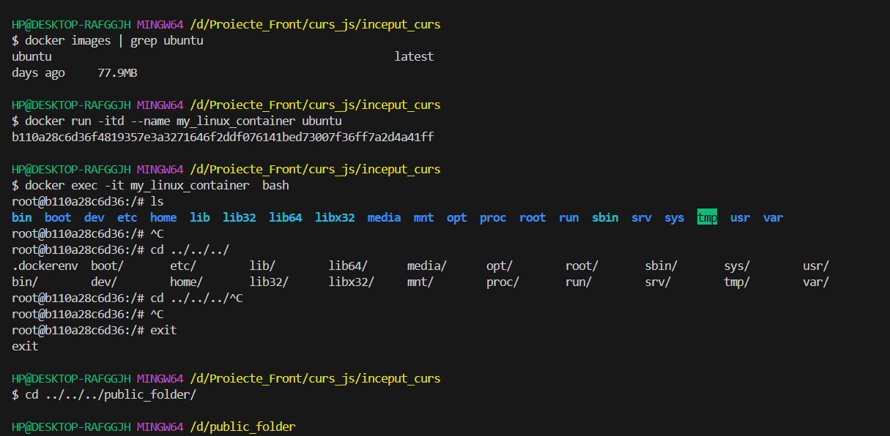
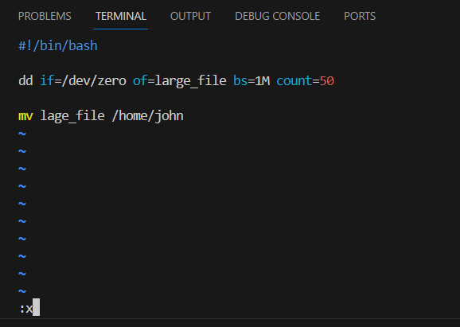
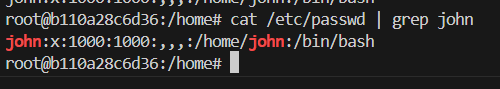
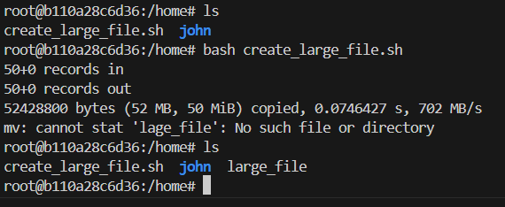
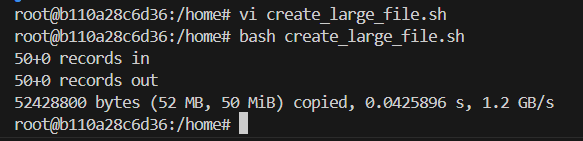
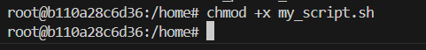
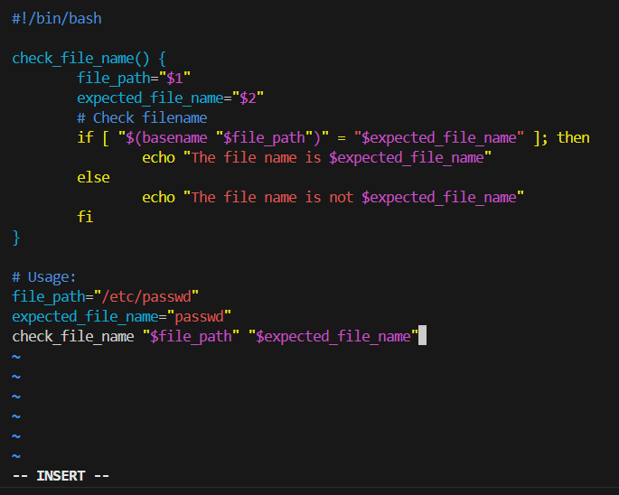
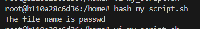
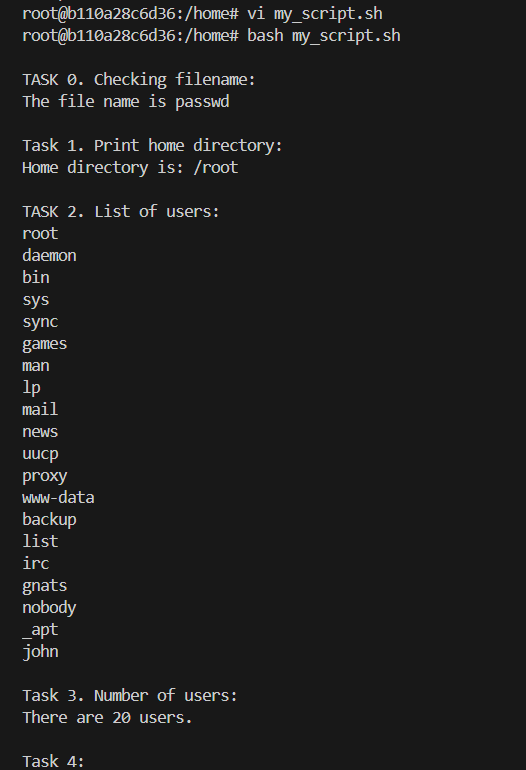
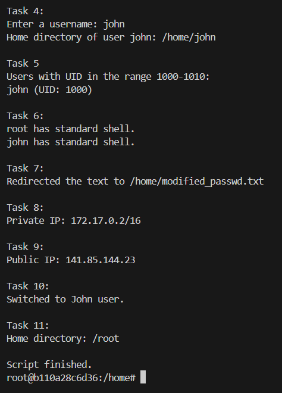

**First problem.**
I preferred to use the terminal from VS Code for a better experience (eg using linux commands like "grep, cd", etc.) :
As for the final code, I didn’t create a function for each task, because some of them had one-line answers and I considered it could be a little redundant.

We observe that the image was pulled succesfully (used grep to locate it as I already have many more images inside my Docker Desktop). I decided to run the container in DETACHED mode (-d), because I don’t like them attached to any of my terminals. I then connected to it with:
**docker exec -it my_linux_container bash**
After that:
**touch create_large_file.sh** ==> create file.
Preparing to edit the file: 
**apt-get update**
**apt-get install vim**
**vi create_large_file.sh** ==> edit file, paste the github content in.

The script looks like this:

(The script creates a file of 1*50 = 50Mb and moves it to /home/john)
**adduser john** ==> add user:
**cat /etc/passwd | grep john** ==> Making sure user is created.

Obviously, there is an error when trying to execute the script:

We need to modify the script, as there is a typo “lage” instead of “laRge”.
Everything seems fine now:

I created the script file “my_script.sh”, then I made sure it has execution privilleges:

**Task 0:**
Wrote a function called “check_file_name” inside the bash script:

Execution:

As for the rest of the tasks, I will simply print the outputs together as there are too many of them to be displayed separately.
Meanwhile, I needed to install iproute2 and curl with apt-get. 
**apt-get install -y iproute2**
**apt-get install -y curl**
Outputs: 

Code is explained in the script’s comments.

**Tasks Done.**