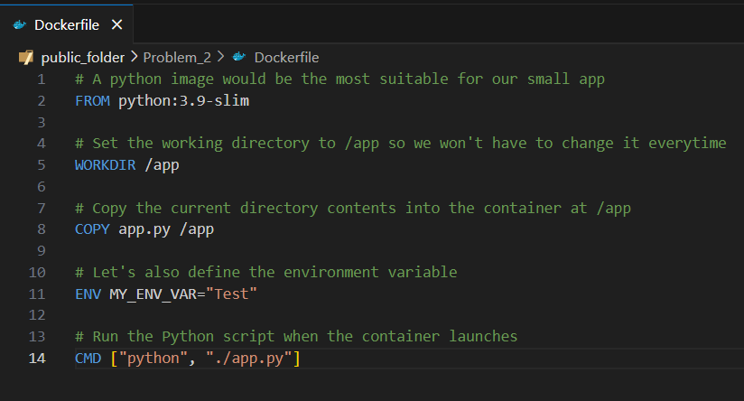
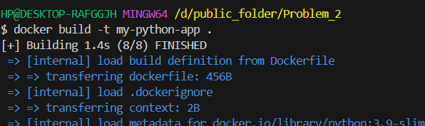
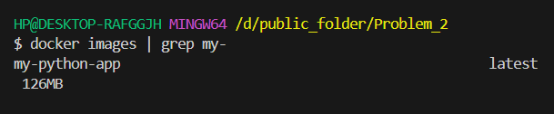
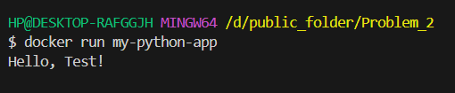
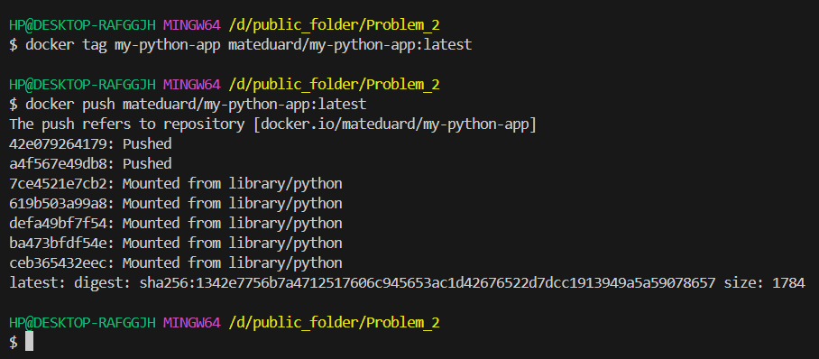
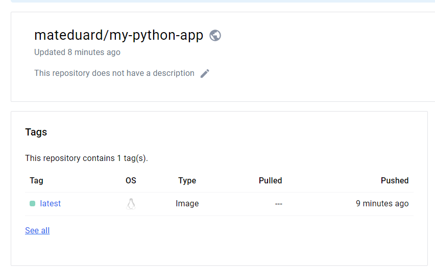

Second problem.
**Task 1:**
I chose the app.py file, as I am more used to its syntax.
**Task 2:**
First, we’ll create a dockerfile which will look like this:

**Task 3:**
Then, we’ll build the image “my-python-app” based on this Dockerfile, using 
**docker build -t my-python-app .**

Verify that the image exists:

We run the image and see the expected output:

**Task 4:**
We tag the docker image before the push with the command: 
**docker tag my-python-app mateduard/my-python-app:latest**
Then, we push to dockerhub with the command **docker push mateduard/my-python-app:latest**

The image was pushed to the following repo:
https://hub.docker.com/repository/docker/mateduard/my-python-app/general

As for the rest of the task, I think there will be necessary to have a PRO DockerHub account, which I don’t, unfortunately:

